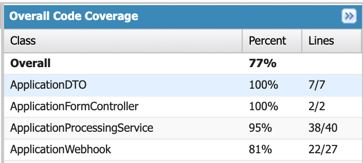

## DevCaseStudy - Tiago Leal

### 1 - Setup Instructions

1. deploy the force-app contents to an org
2. Enable/Configure digital experieces
3. Configure public access for the digital experiences
4. Configure public access for sites
5. Create new page for the digital experiences
6. Drag n drop the component `Dev - Application Form` to the page
7. Set page as public in Digital Experiences > Builder > Navigation > Public Available

### 2 - Testing the public Webhook

1. One can use the following request:
```bash
curl -v -H "Content-Type: application/json" -X POST \
     -d '{"companyName": "Acme Corp", "federalTaxId": "BG123456789", "contact": { "firstName": "Ivan", "lastName": "Ivanov", "email": "ivan@example.com", "phone": "+359888123456" }, "annualRevenue": 500000}' https://orgfarm-fadf428d4e-dev-ed.develop.my.site.com/services/apexrest/external/applications
```
2. The output should look like:
```
< HTTP/2 200 
< date: Fri, 12 Dec 2025 21:26:02 GMT
< content-type: application/json;charset=UTF-8
< vary: Accept-Encoding
< set-cookie: CookieConsentPolicy=0:1; path=/; expires=Sat, 12-Dec-2026 21:26:01 GMT; Max-Age=31536000; secure
< set-cookie: LSKey-c$CookieConsentPolicy=0:1; path=/; expires=Sat, 12-Dec-2026 21:26:01 GMT; Max-Age=31536000; secure
< x-content-type-options: nosniff
< strict-transport-security: max-age=63072000; includeSubDomains
< cache-control: no-cache,must-revalidate,max-age=0,no-store,private
< set-cookie: BrowserId=KHz2ztehEfClD-9innCsdw; path=/; expires=Sat, 12-Dec-2026 21:26:01 GMT; Max-Age=31536000; secure; SameSite=None
< server: sfdcedge
< x-sfdc-request-id: 0ec7fe77d8aff85d3d837b2c2c6acb77
< x-request-id: 0ec7fe77d8aff85d3d837b2c2c6acb77
< 
* Connection #0 to host orgfarm-fadf428d4e-dev-ed.develop.my.site.com left intact
{"success":true,"recordType":"Lead","recordId":"00QdL00000UNS3xUAH","message":"Lead created successfully with Id: 00QdL00000UNS3xUAH"}%              
```

### 3 - Code Coverage


### 4 - Deliverables
1. Apex:
    - [ApplicationFormController](https://github.com/tibeal/devCaseStudy/blob/master/force-app/main/default/classes/ApplicationFormController.cls)
    - [ApplicationWebhook](https://github.com/tibeal/devCaseStudy/blob/master/force-app/main/default/classes/ApplicationWebhook.cls)
    - [ApplicationProcessingService](https://github.com/tibeal/devCaseStudy/blob/master/force-app/main/default/classes/ApplicationProcessingService.cls)
    - [DTO + wrapper classes](https://github.com/tibeal/devCaseStudy/tree/master/force-app/main/default/classes)
    - [Test class(es)]()
        - [ApplicationFormControllerTest](https://github.com/tibeal/devCaseStudy/blob/master/force-app/main/default/classes/ApplicationFormControllerTest.cls)
        - [ApplicationWebhookTest](https://github.com/tibeal/devCaseStudy/blob/master/force-app/main/default/classes/ApplicationWebhookTest.cls)
2. LWC:
- [applicationForm.html](https://github.com/tibeal/devCaseStudy/blob/master/force-app/main/default/lwc/applicationForm/applicationForm.html)
- [applicationForm.js](https://github.com/tibeal/devCaseStudy/blob/master/force-app/main/default/lwc/applicationForm/applicationForm.js)
- [applicationForm.js-meta.xml](https://github.com/tibeal/devCaseStudy/blob/master/force-app/main/default/lwc/applicationForm/applicationForm.js-meta.xml)